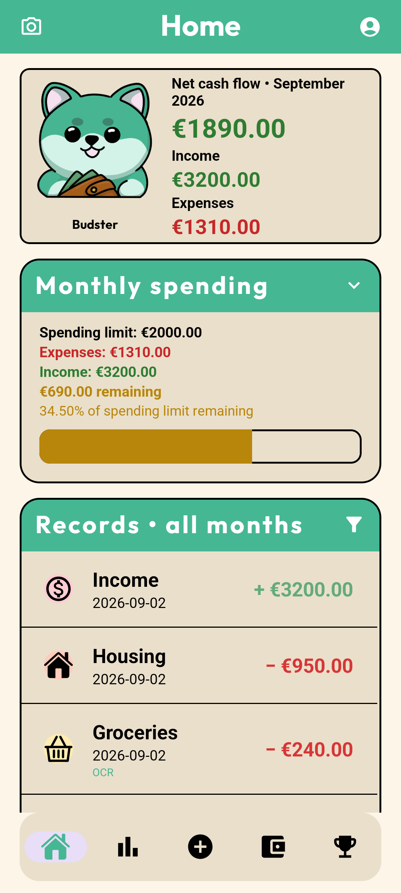
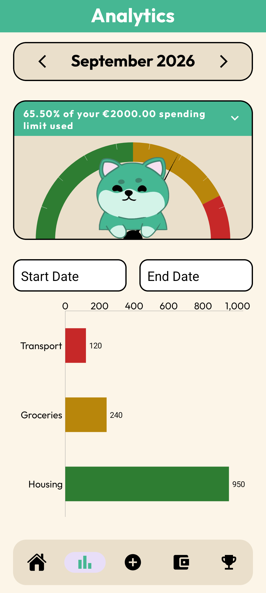
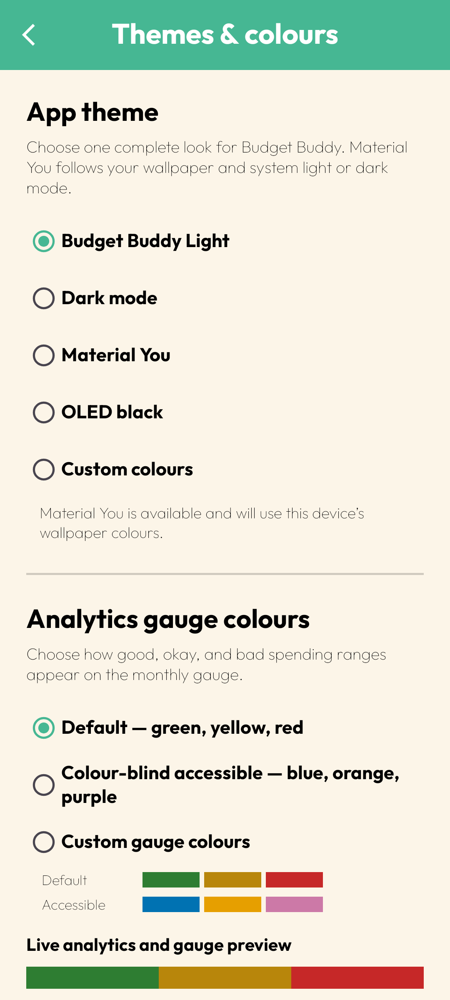
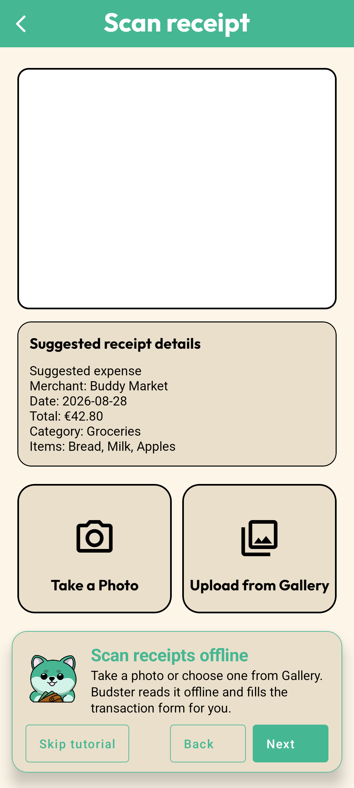

<p align="center">
  
  <br />
  
</p>

# Budget Buddy 3.0 Stable

Budget Buddy is a playful, accessible Android budgeting app that works intentionally and completely offline. It helps people see how their finances are doing now, understand where money is going, and plan a monthly budget for what comes next—without creating an account or handing personal financial records to a server.

> **AI summary:** Budget Buddy 3.0 is a private offline budget planner with clear visual analytics, flexible themes, a guided tutorial, and a choice between faster receipt entry with on-device OCR or a smaller manual-only app.

## Why Budget Buddy exists

Money tools should be understandable at a glance. Budget Buddy combines plain-language totals, colour-matched spending feedback, charts, category budgets, and Budster's expressions so that a user does not need to decode a spreadsheet before making a decision. Accessibility is part of the design: the app includes readable light, dark, Material You, OLED black, and custom themes; a colour-blind-friendly gauge palette; searchable currencies; large touch targets; and a replayable, hands-on tutorial.

Offline is not a fallback mode. It is the product design. Profiles, transactions, budgets, categories, receipts, recognised text, settings, and achievements live in Android's private app storage and remain usable with airplane mode enabled.

## Choose your Budget Buddy

Both editions are named **Budget Buddy** on the phone and can be installed together because they use separate Android package identities.

| Edition | Best for | Receipt workflow | Storage footprint |
| --- | --- | --- | --- |
| **Budget Buddy OCR** (`com.budgetbuddy`) | Faster reading and writing of receipt-based expenses | Take or choose a receipt photo, receive on-device suggestions, review them, then save | Larger because the offline text-recognition model is bundled into the APK |
| **Budget Buddy No OCR** (`com.budgetbuddy.manual`) | Maximum manual control and a smaller installation | Enter transaction details manually; receipt photos can still be attached | Smaller because it does not contain the recognition model or OCR pipeline |

The finance engine, themes, analytics, budgets, categories, tutorial, achievements, local storage protections, and visual design are shared. Receipt photos themselves use device storage in either edition when attached.

## See 3.0 in action

<p align="center">
  
  
</p>
<p align="center">
  
  
</p>

## Install 3.0 Stable

1. Open the [Budget Buddy 3.0 Stable release](https://github.com/MLN-WORK/Budget-Buddy/releases/tag/v3.0.0-stable) on an Android phone.
2. Download **Budget-Buddy-OCR-v3.0-stable.apk** or **Budget-Buddy-No-OCR-v3.0-stable.apk** under **Assets**.
3. If Android asks, allow the browser or file manager to install apps from that source.
4. Open the APK, tap **Install**, then open **Budget Buddy** and complete the local setup.

Android may warn that the APK came from outside the Play Store. That is normal for a direct release download. Install only assets attached to this repository's official release. Android 8.1 or newer is required. Camera access is optional; denying it does not block manual budgeting or gallery selection.

The two 3.0 editions install side by side. They keep separate local data and do not copy records from old `com.example.budgetbuddy` builds. A fresh install is recommended for this stable transition.

## What 3.0 can do

- Open directly into a private local profile—no sign-in, email, password, cloud verification, subscription, or remote database.
- Track income and expenses with dates, categories, amounts, notes, and optional local receipt images.
- Keep the monthly spending limit separate from income, with an explicit choice to add an income record to that month's limit.
- Recalculate budget totals after transaction additions, edits, and deletions.
- Create custom categories and allocate optional category budgets beneath the main monthly limit.
- Show cash flow, remaining allowance, transaction history, category charts, and a bounded spending gauge that remains safe when the budget is zero or exceeded.
- Match Home, Analytics, tutorial examples, Budster, and chart feedback to the same selected gauge colours.
- Use Light, Dark, Material You, true OLED black, or Custom colours and preview changes live before leaving the theme screen.
- Choose the default green/dark-yellow/red gauge, a colour-blind-accessible blue/orange/purple gauge, or a custom palette.
- Search 45 bundled currencies by name, ISO code, or symbol, or define a custom currency.
- Filter history by transaction type, OCR source, and date; tap a record for details or editing and press and hold to delete it.
- Preserve an unfinished transaction only when the user enables that preference; category creation safely keeps the current form.
- Follow a six-part interactive tutorial using the real Home, Budget, Transaction, OCR, Analytics, and Achievement screens, then replay it from Settings.
- Earn clearly labelled achievements, including a three-distinct-consecutive-month budgeting streak.

## How offline OCR works

The OCR edition is designed to shorten data entry without turning a receipt into an automatic financial decision.

1. **Capture or choose.** The user takes a photo through Android's camera flow or selects one through Android's privacy-friendly photo picker.
2. **Normalise safely.** Budget Buddy decodes the image away from the main screen, corrects its orientation, scales oversized input to a bounded size, writes a local JPEG atomically, and validates the result before attachment. Replaced, cancelled, failed, and unfinished copies are cleaned up.
3. **Recognise on the device.** A bundled Google ML Kit Latin text-recognition model reads the image locally. The app has no internet permission and does not need to download a recognition model at runtime.
4. **Turn text into suggestions.** Budget Buddy examines receipt lines for merchant, date, total, and useful item text. It favours prominent text near the top for the merchant, applies date and currency-aware parsing, and uses the scan date when a receipt date is missing.
5. **Suggest a category.** A local classifier maps recognised words to a likely category. OCR records also carry a protected internal OCR identity, so renaming the visible OCR label does not break existing records, budgets, icons, or filters.
6. **Keep the person in control.** Suggestions fill a preview or transaction form; the user can inspect and change every field before saving. An optional Settings switch adds a separate confirmation step before suggestions are applied.
7. **Store locally.** The approved transaction, receipt copy, and recognised text stay inside the app's private storage. The camera or gallery original is not uploaded by Budget Buddy.

The No OCR edition omits steps 3–6 and keeps the same image-attachment and manual transaction tools.

## From the first prototype to a fully offline app

### The original online era

Budget Buddy began as a fully online database-driven prototype. It depended on online account and database features and had no usable offline capability. It also had one fixed visual style, no theme studio, no OCR option, no guided tutorial, fewer safety checks around receipts and budgets, and no choice between app editions. That legacy implementation predates the retained offline Git history in this repository.

The project was deliberately rebuilt around a different promise: a budgeting companion should still work when the network is unavailable, and private day-to-day finance data should not need to leave the device. The online account, remote database, and abandoned service configuration were removed rather than left dormant.

### Offline release history

| Version | What changed | How it was tackled |
| --- | --- | --- |
| **2.0 — Offline reset** | Replaced the online account/database flow with a local profile, local transactions, receipt attachments, edit/delete, budget rebuilding, and achievements. | Made app-private storage the source of truth and rebuilt onboarding around **Continue offline**. |
| **2.1 — Interface hardening** | Added the launcher identity, better contrast, immersive layout, consistent navigation, category selectors, and safer camera behaviour. | Standardised shared screen controls and upgraded Android tooling and APIs. |
| **2.2 — Meet Budster** | Introduced Budster, dark mode, first-run onboarding, fixed navigation, safer over-budget analytics, and first-Home camera permission. | Centralised companion thresholds and moved permission education into the real user journey. |
| **2.3 — Receipt reliability** | Rebuilt capture, gallery selection, validation, storage cleanup, Home navigation, and achievement badges. | Added bounded image handling, app-owned copies, lifecycle cleanup, and dedicated locked/unlocked badge states. |
| **2.4 — Currency and gauge consistency** | Added Euro as the default, 45 searchable offline currencies, robust receipt processing, and aligned gauge/Budster thresholds. | Introduced a local currency catalogue and one shared spending-status calculation. |
| **2.5 — Safer budgeting** | Fixed the receipt-placeholder crash, counted uncategorised expenses, clarified the maximum budget, added categories, made income categories optional, introduced Material You, and polished layouts. | Covered empty and uncategorised states explicitly and separated required expense data from optional income metadata. |
| **2.6 — Theme studio** | Added Light, Dark, Material You, OLED black, Custom colours, exact gauge palettes, and a gauge needle. | Centralised appearance preferences and exposed live theme and analytics previews. |
| **2.6.1 — Theme lifecycle fix** | Stabilised Material You and made OLED genuinely black. | Re-applied appearance at the correct activity lifecycle point and separated OLED surfaces from ordinary dark surfaces. |
| **2.7 — Data integrity and flow** | Allowed a monthly limit without category budgets, recalculated totals from transactions, protected transaction drafts, added curated icons, and moved to `com.budgetbuddy`. | Rebuilt totals from saved records instead of fragile deltas and gave navigation an explicit draft policy. |
| **3.0 Stable — Two editions, one mission** | Added bundled offline OCR, OCR review and classification, detailed record views, the full interactive tutorial, side-by-side OCR/No OCR packages, theme-live-update repairs, OLED layout stability, exact gauge colour propagation, a darker visible neutral yellow, security hardening, and full class documentation. | Split optional recognition from the shared finance app, consolidated all status colours into one source, tested tutorial examples on a real Android runtime, constrained exported components and networking, and documented each class's role and relationships. |

## Privacy and security

- Neither edition requests `INTERNET` or `ACCESS_NETWORK_STATE`; transitive declarations are explicitly removed from the final manifest.
- There is no Firebase, advertising SDK, remote database, cloud synchronisation, account token, analytics endpoint, or supported secret configuration.
- Android cloud backup and device-to-device data extraction are disabled with `allowBackup=false` and restrictive backup rules.
- Cleartext traffic is disabled, even though the app has no network permission.
- Only the launcher activity is exported. Internal activities and the receipt file provider are not exported, and receipt URIs are granted only to the chosen camera handler for the required operation.
- Release builds disable debugging and enable code shrinking and resource shrinking.
- Receipt decoding is bounded, file writes are atomic, invalid files are rejected, and abandoned app-owned copies are deleted.
- Amounts, dates, names, category labels, currency values, colours, and image inputs are validated before persistence or use.
- Keys, signing stores, local SDK paths, environment files, logs, build output, and APKs are excluded from source control.
- Every Kotlin class has a start/end documentation block naming the class and related parent/child collaborators, what it does, and what other classes need to know, with focused comments around non-obvious code.

Google's bundled ML Kit performs receipt text recognition on-device. Google documents that input and output content is not sent to its servers, while its SDK terms allow collection of technical performance and API-usage metrics; the OCR edition discloses that distinction in Settings.

App data is protected by Android's application sandbox. Clearing app data or uninstalling an edition removes that edition's local records and receipt copies.

## For developers

Budget Buddy is a single-module native Android application written in Kotlin with Activity-based screens and XML layouts.

### Source editions

- [`main`](https://github.com/MLN-WORK/Budget-Buddy/tree/main) contains the OCR edition.
- [`no-ocr`](https://github.com/MLN-WORK/Budget-Buddy/tree/no-ocr) contains the smaller manual edition.

### Technology

- Kotlin 2.1, Android SDK 36, minimum SDK 27, and JDK 17+
- Gradle 8.14.5, Android Gradle Plugin 8.13.2, and Kotlin DSL
- AndroidX, Material Components, View Binding, and Data Binding
- MPAndroidChart and SpeedView for offline visualisations
- Glide for local receipt images
- Bundled Google ML Kit Text Recognition in the OCR edition only
- JUnit 4 and AndroidX Espresso tests

### Important structure

```text
app/src/main/java/com/budgetbuddy/
  WelcomeActivity.kt                 Secure launcher and first-run routing
  ProfileActivity.kt                 Local profile, currency, OCR, and app settings
  ThemeColorsActivity.kt             Live theme and gauge-colour studio
  AppearancePreferences.kt           Central theme and status-palette state
  TutorialFlow.kt                    Real-screen interactive tutorial coordinator
  LocalDataStore.kt                  App-private persistence and budget rebuilding
  FinanceCalculator.kt               Pure finance calculations
  MainActivity.kt                    Home dashboard and records
  TransactionActivity.kt             Add/edit transactions and attachments
  AddImageActivity.kt                Camera/photo-picker and OCR entry screen
  ReceiptStorage.kt                  Receipt validation and lifecycle cleanup
  ReceiptImageNormalizer.kt          Bounded orientation and JPEG processing
  ReceiptOcrScanner.kt               Bundled on-device recognition (OCR branch)
  ReceiptParser.kt                   Receipt suggestion extraction (OCR branch)
  ReceiptCategoryClassifier.kt       Local category suggestions (OCR branch)
  TransactionDetailActivity.kt       Readable single-record view
  TransactionHistoryActivity.kt      Filter, edit, and delete history
  BudgetActivity.kt                  Monthly and category budgets
  AnalyticsActivity.kt               Charts, gauge, and status feedback
  AnalyticsCalculator.kt             Bounded gauge calculations and colours
  AchievementActivity.kt             Achievement progress and badges
```

### Build and test

Development dependency downloads require internet access; the resulting app does not. With Android SDK 36 configured in an ignored `local.properties` file:

```powershell
.\gradlew.bat testDebugUnitTest
.\gradlew.bat lintDebug
.\gradlew.bat assembleRelease
.\gradlew.bat assembleDebugAndroidTest
.\gradlew.bat connectedDebugAndroidTest
```

Use `./gradlew` on macOS or Linux. No runtime environment variables, server credentials, database migrations, datasets, or downloadable models are required.

## Licence and release integrity

Release APKs are attached to the [official GitHub Releases page](https://github.com/MLN-WORK/Budget-Buddy/releases). SHA-256 checksums are included in the 3.0 Stable release notes so a downloaded file can be verified before installation.
